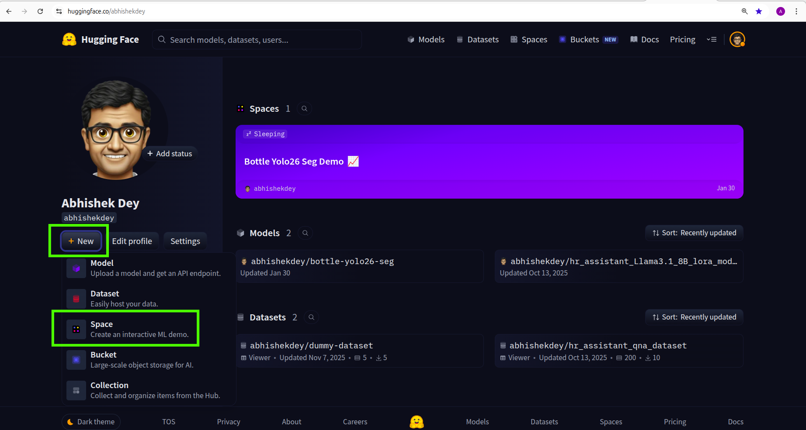
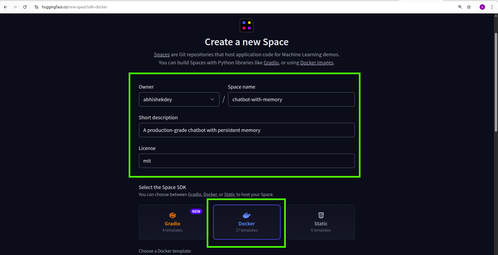
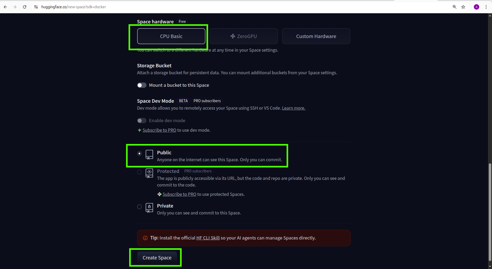
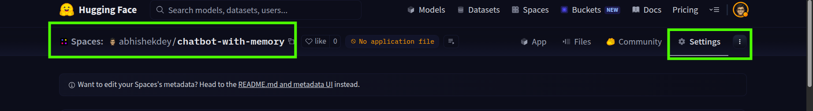
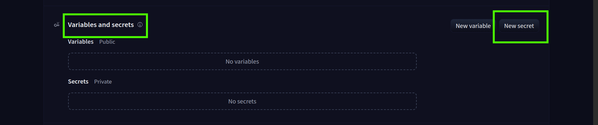
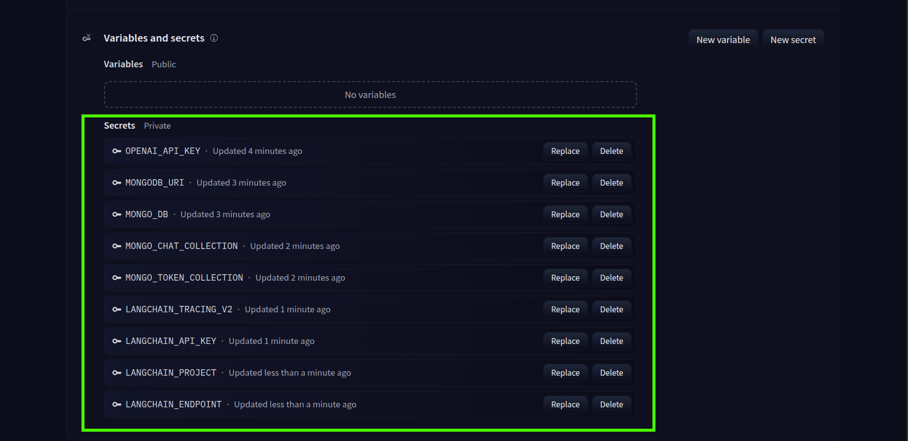
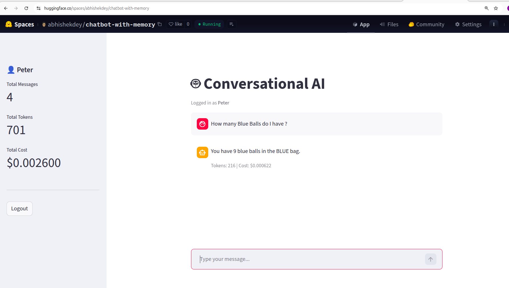

## Hugging Face Deployment Steps:

* Author: Abhishek Dey

### Step-1 : Create a new space

* Go to [Hugging Face](https://huggingface.co/) and Login to your account

* Click **New Space**

<p align="left">

</p>

* Fillup the below information

<p align="left">

</p>

* Make sure you select **public** for visibility and **create space** 

<p align="left">

</p>

### Step-2: Add Secrets

* Never commit **.env** to Hugging Face. Use **Secrets** instead.

* Go to your Space -> Settings 

<p align="left">

</p>

* Go to Variables and Secrets  & Click **New Secret** 

<p align="left">

</p>

* Add all secrets one by one

<p align="left">

</p>

### Step-3 Push codes to hugging face space

* Install git-lfs if not already

```
sudo apt install git-lfs

git lfs install
```

* Clone HuggingFace Space

```
git clone https://huggingface.co/spaces/abhishekdey/chatbot-with-memory

cd chatbot-with-memory
```
* Copy project files

```
cp -r ../GenAI-production-grade-projects/01-ChatBot-with-memory/src/ ./
cp -r ../GenAI-production-grade-projects/01-ChatBot-with-memory/app.py ./
cp -r ../GenAI-production-grade-projects/01-ChatBot-with-memory/requirements.txt ./
cp -r ../GenAI-production-grade-projects/01-ChatBot-with-memory/Dockerfile ./
```

### Step-4: Add the below changes

* Change the ports in Docker file from **8501** to **7860**

* Add **0.0.0.0/0** in MongoDB IP Access List

### Step-5:  Commit and push

```
git add .
git commit -m "initial deployment"
git push
```

* App is up and running in Hugging Face  in [https://huggingface.co/spaces/abhishekdey/chatbot-with-memory](https://huggingface.co/spaces/abhishekdey/chatbot-with-memory)

<p align="left">

</p>


