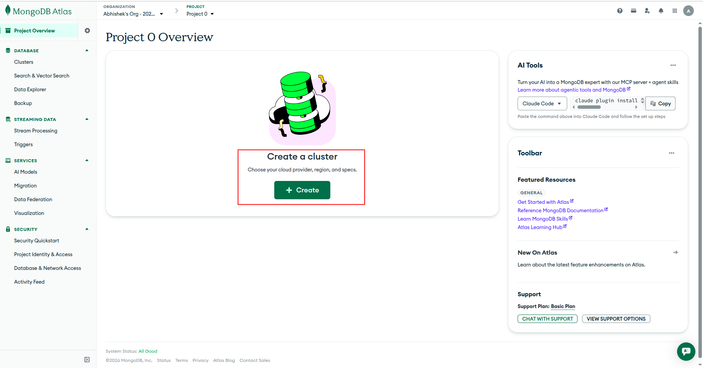
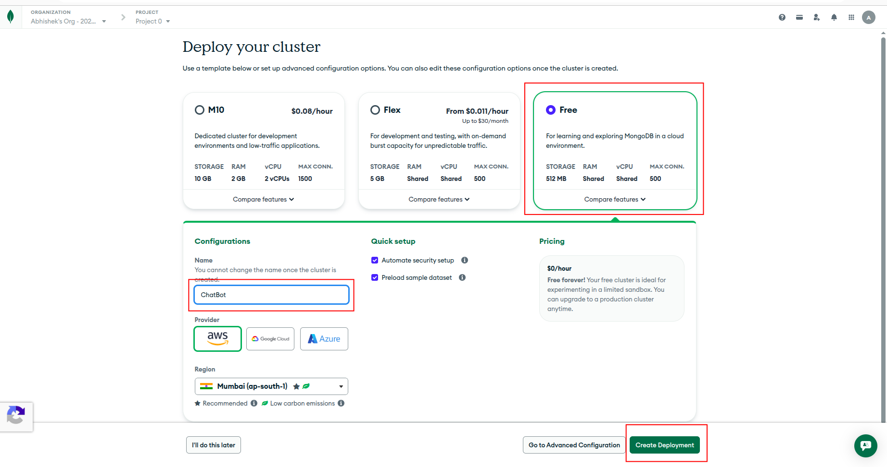
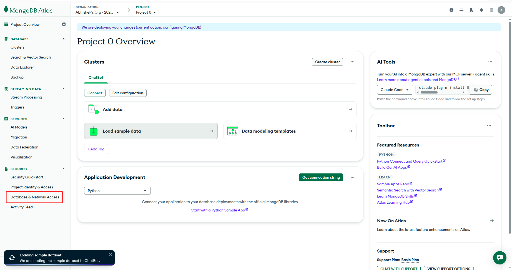
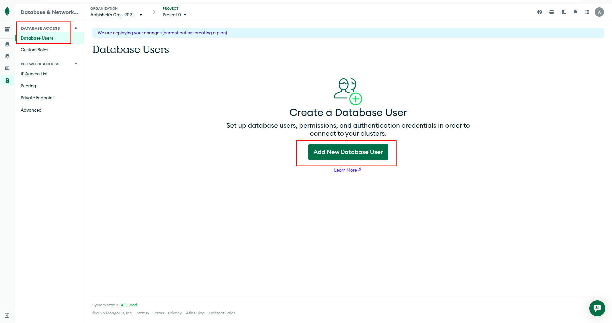
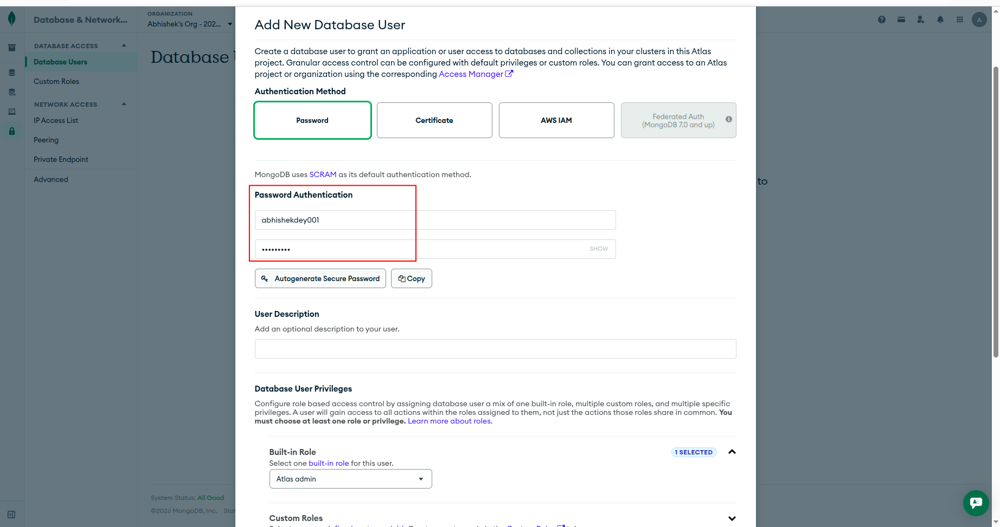
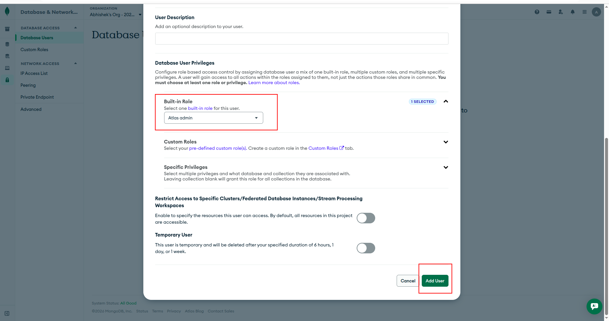
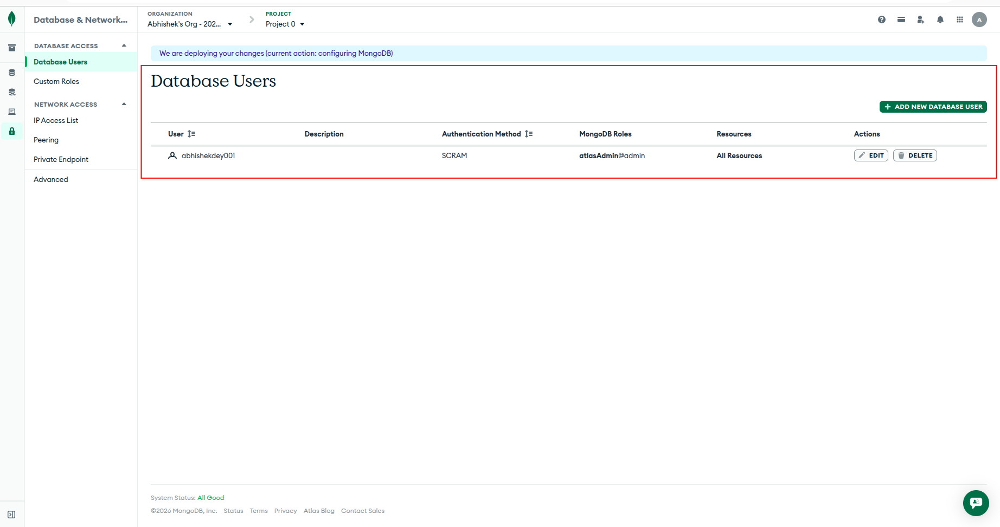
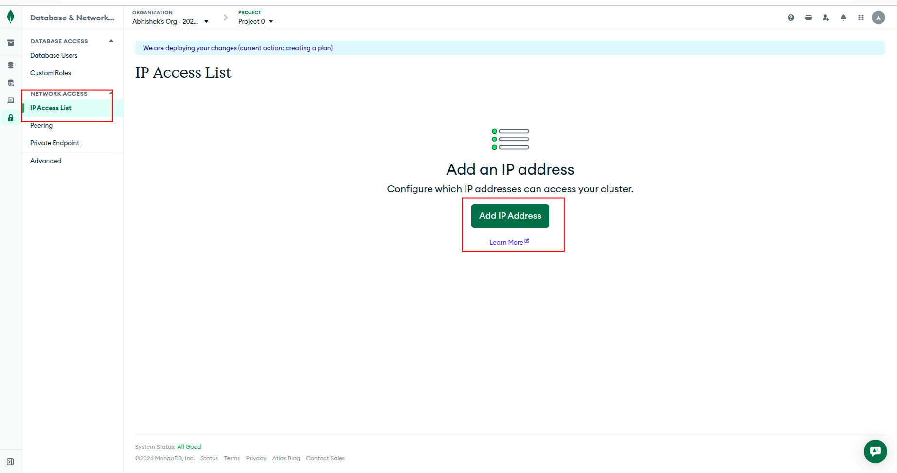
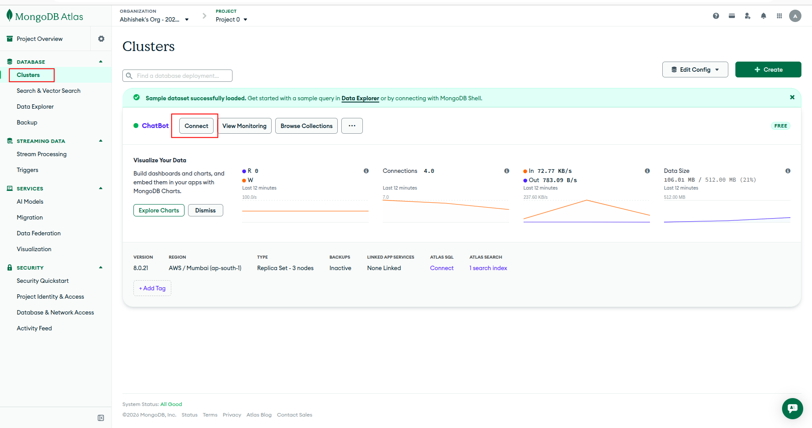
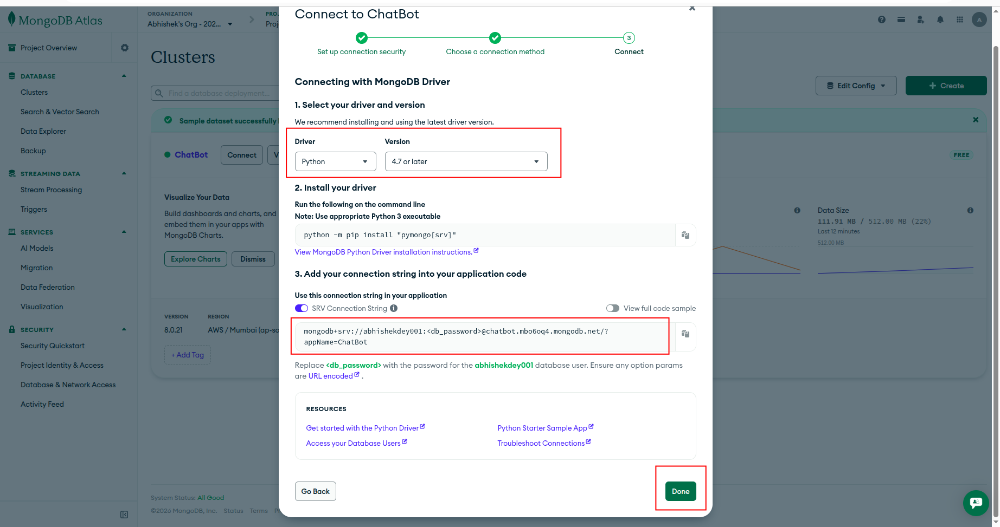

## MongoDB Database Creation

### Step-1: Login to Mongo DB

*  Go to [Mongo DB](https://www.mongodb.com/)

* Login with your GMAIL credentials

### Step-2: Create a new Cluster

* Click on **Create a Cluster**

* Select **Free Plan** 

* Give a database name **"ChatBot"** in **Configurations**

* Click on **Create Deployment**

### Step-3: Go to Database & Network Access

* Add a **New Database User**

* Add **password authentication**

* Select **Atlas admin**  as **Built-in Role** and select **Add user**

* New database user is added

### Step-4: Add IP address

* Go to **NETWORK ACCESS -> IP Access List -> Add IP Address**

### Step-5: Connect to ChatBot

* Go to **DATABASE -> Clusters -> ChatBot (Connect)**

* Select **Drivers** and add the connection string to .env file 

