# Title: ChatBot with memory

**Author: Abhishek Dey**

## About:

A production-grade chatbot that remembers conversations across sessions using MongoDB. Built with LangChain, OpenAI GPT-4o, and tracked with LangSmith.

---

## What This Does

Most chatbots forget everything when you close the window. This one doesn't.

- Each user has their own persistent conversation history stored in MongoDB
- When a user returns, the LLM picks up exactly where it left off
- Every message tracks token usage and cost
- All LLM calls are traced end-to-end via LangSmith

---

## Live Demo

👉 [Hugging Face Space](https://huggingface.co/spaces/abhishekdey/chatbot-with-memory)

---
=
## Tech Stack

| Component       | Tool                        |
|-----------------|-----------------------------|
| LLM             | OpenAI GPT-4o               |
| Framework       | LangChain + LCEL            |
| Memory Store    | MongoDB Atlas               |
| Observability   | LangSmith                   |
| Terminal UI     | Python CLI                  |
| Web UI          | Streamlit                   |
| Containerisation| Docker                      |

---

## Project Structure

```
01-conversational-ai-with-persistent-memory/
├── chatbot.py                -> run in terminal
├── app.py                       -> run in browser (Streamlit)
├── requirements.txt   -> dependency requierements
├── example.env           -> copy this to .env and fill in keys
├── Dockerfile      
├── README.md
└── src/
    ├── __init__.py
    ├── llm.py                 -> LLM setup (swap models here)
    ├── database.py     -> MongoDB connection + operations
    └── chain.py            -> LangChain chain + history logic
```

---

## MongoDB Collections

```
chatbot_db
├── chat_histories     -> saves full conversation per user
└── token_usage        -> tracks token count + cost per message
```

---

## Quickstart

### 1. Clone the repo

```
git clone https://github.com/ai-abhishekdey/genai-production-grade-projects.git

cd 01-ChatBot-with-memory
```

### 2. Virtual environment

* Install uv (if not installed)
```
curl -LsSf https://astral.sh/uv/install.sh | sh
```

* Create venv with Python 3.12 and install dependencies

```
uv venv --python 3.12
source .venv/bin/activate   
uv pip install -r requirements.txt
```

### 3. Set up environment variables

```
cp .env.example .env
```

* Fill in your `.env`:

```
# LLM
OPENAI_API_KEY=sk-********************

# MongoDB
MONGODB_URI=mongodb+srv://<username>:<password>@chatbot.nle32ij.mongodb.net/
MONGO_DB=chatbot_db
MONGO_CHAT_COLLECTION=chat_histories
MONGO_TOKEN_COLLECTION=token_usage

# LangSmith
LANGCHAIN_TRACING_V2=true
LANGCHAIN_API_KEY=lsv2_******************************
LANGCHAIN_PROJECT=conversational-ai-with-persistent-memory
LANGCHAIN_ENDPOINT=https://api.smith.langchain.com
```
### 4. Setup MongoDB Database

* Follow the steps mentioned in [MONGO_DB.md](MONGO_DB.md)

### 5. Run Terminal Version

```
python chatbot.py
```

### Outputs:

* **Initial Chat**

<p align="left">
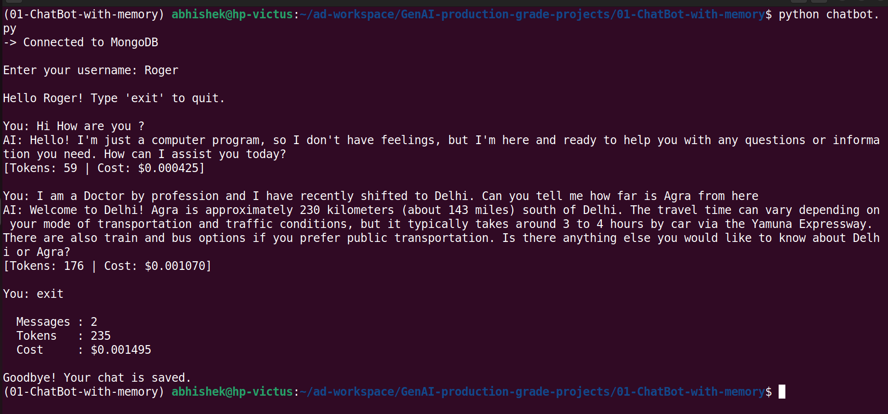
</p>

* **Second Chat : Demonstrating memory from previous chat**

<p align="left">
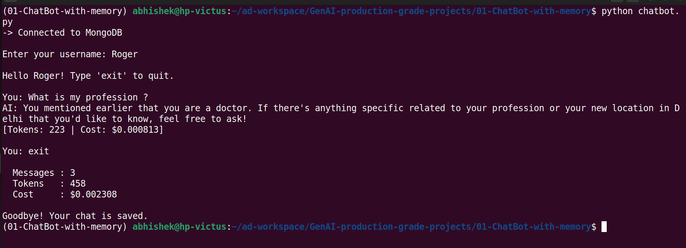
</p>

### LangSmith Observability:

<p align="left">
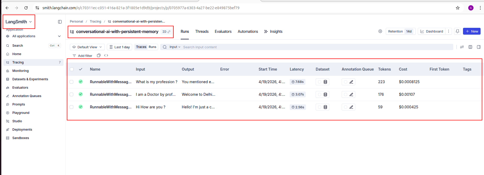
</p>

### MongoDB:

* **Database and collections**

<p align="left">
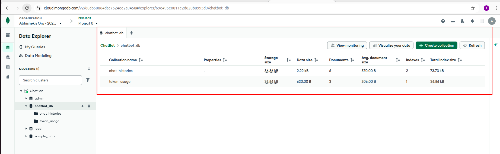
</p>

* **Chat_histories**

<p align="left">
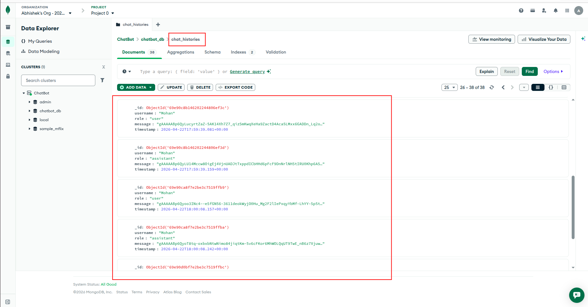
</p>

* **token_usage**

<p align="left">
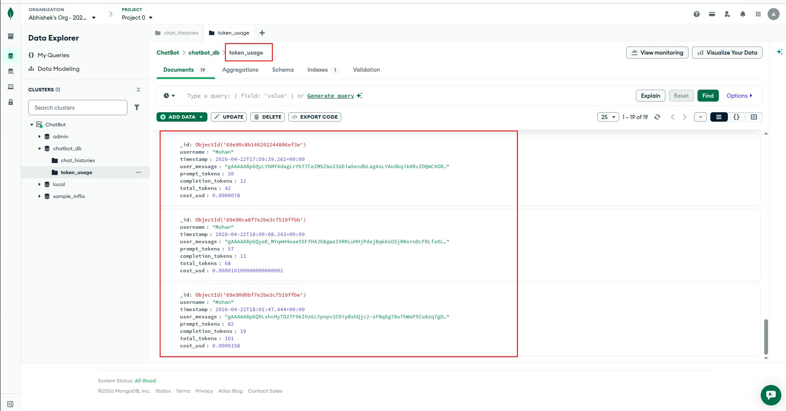
</p>

### 6. Run Streamlit version
```
streamlit run app.py
```
<p align="left">
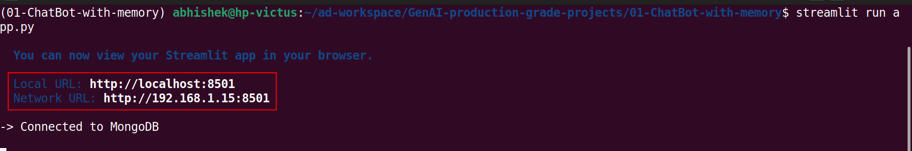
</p>

### Outputs

* **Login Screen**

<p align="left">
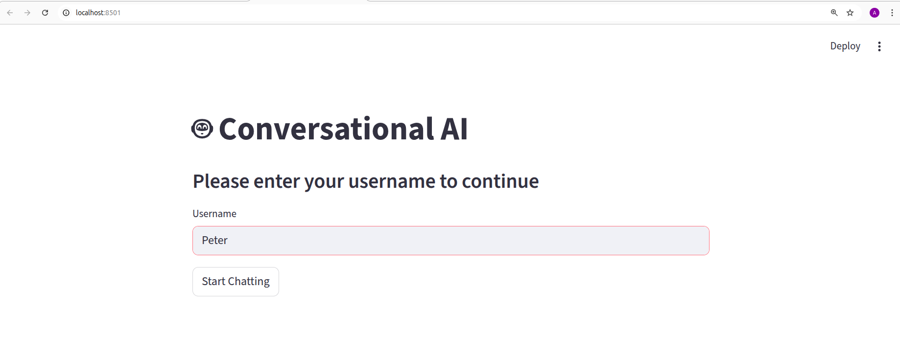
</p>

* **Intial Chat** 

<p align="left">
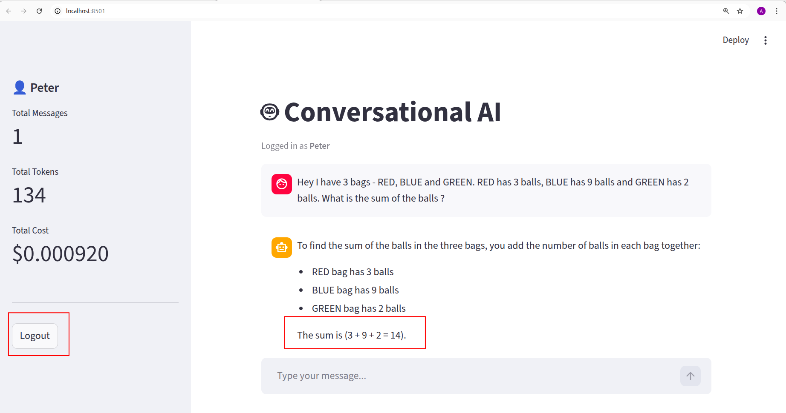
</p>

* **Second Chat : Demonstrating memory from previous chat**

<p align="left">
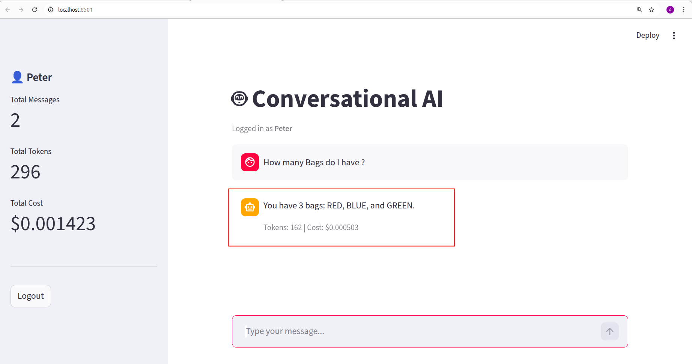
</p>

### LangSmith Observability:

<p align="left">
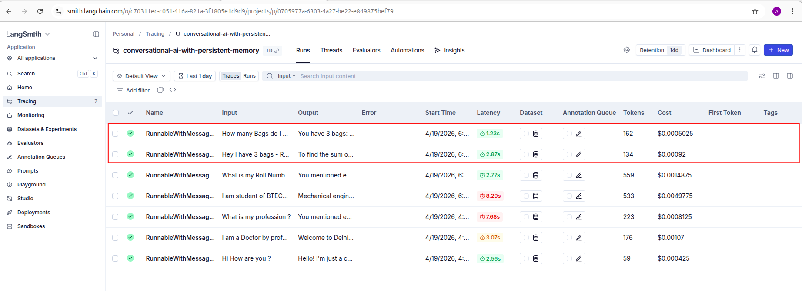
</p>

### MongoDB:

* **Chat_histories**

<p align="left">
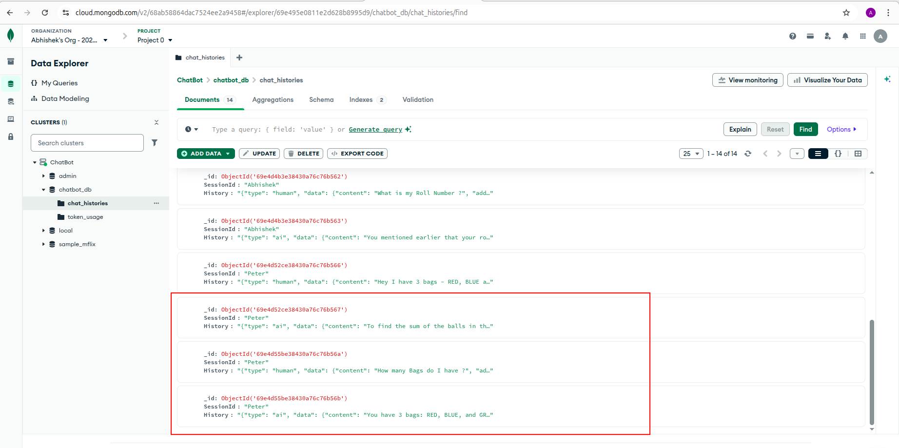
</p>

* **token_usage**

<p align="left">
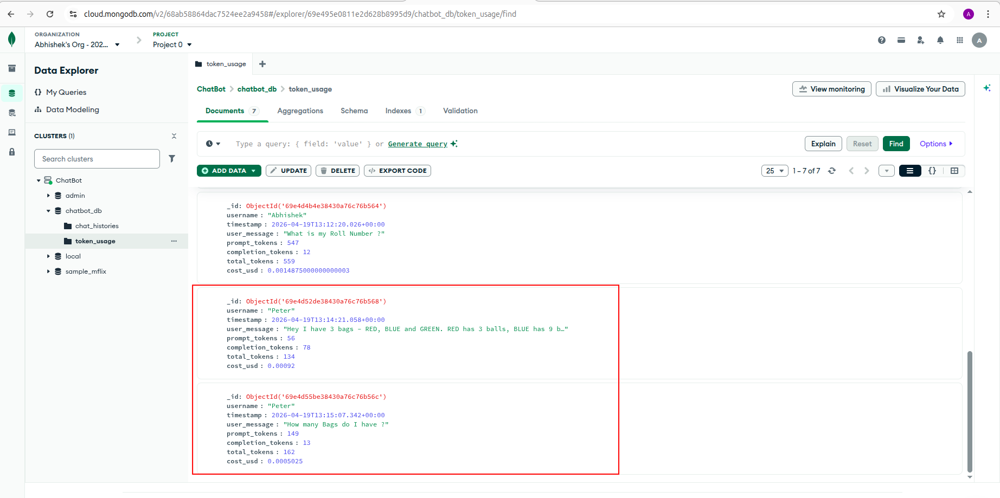
</p>


## 7. Dockerization

* Build Docker image
```
docker build -t conversational-ai .
```

* Run Docker image locally

```
docker run -p 8501:8501 --env-file .env conversational-ai
```
* Login to Docker Hub

```
docker login
```
* Tag the Image

```
docker tag conversational-ai abhishekdey001/conversational-ai:latest
```

* Push the image to docker hub
```
docker push abhishekdey001/conversational-ai:latest
```

## 8. Deployment

* The app is deployed in Hugging Face.  Follow the steps mentioned in [HUGGING_FACE.md](HUGGING_FACE.md)

