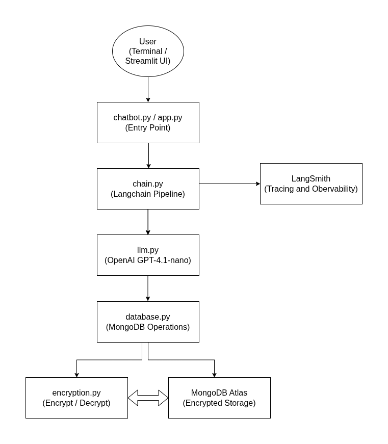

# Title: Conversational AI ChatBot with persistant memory

**Author: Abhishek Dey**

## About:

- A production-grade conversational AI chatbot built using **LangChain**, powered by **OpenAI’s GPT-4.1-nano** model

- Maintains conversation context across sessions so users can resume chats seamlessly

- Stores chat history in **MongoDB** for persistence and retrieval

- **Encrypts** messages before storage and **decrypts** them only when needed, ensuring data is not saved in plain text

- Tracks **token usage** and associated cost for every interaction

- Provides end-to-end tracing of LLM calls using **LangSmith**
---

## Live Demo:

👉 [Hugging Face Space](https://huggingface.co/spaces/abhishekdey/chatbot-with-memory)

---

## Architecture:

<p align="left">

</p>

1. User sends input (CLI or Streamlit UI)
2. chain.py fetches past history from database.py
3. database.py decrypts messages using encryption.py
4. Decrypted history + user input is fed to LLM (via llm.py)
5. LangSmith traces the LLM call
6. Response is returned
7. Messages are encrypted again
8. Encrypted data is stored in MongoDB Atlas
---

## Tech Stack:

| Component                     | Tool                                     |
| -------------------------------- | --------------------------------- |
| LLM                                   | OpenAI GPT-4.1-nano     |
| Framework                      | LangChain (LCEL)              |
| Memory Store                | MongoDB Atlas                 |
| Encryption / Decryption   | cryptography (Fernet - AES-based) |
| Observability                 | LangSmith                           |
| Backend Interface       | Python (CLI)                         |
| Web Interface              | Streamlit                                |
| Containerization         | Docker                                    |
---

## Project Structure:

```
01-conversational-ai-with-persistent-memory/
├── chatbot.py                 -> Entry point for terminal-based chatbot
├── app.py                     -> Streamlit web application
├── requirements.txt           -> Python dependencies
├── example.env                -> Environment variables template (copy to .env)
├── generate_encryption_key.py -> Utility script to generate Fernet encryption key
├── Dockerfile                 -> Containerization setup
├── README.md
└── src/
    ├── __init__.py
    ├── llm.py                 -> LLM configuration and initialization
    ├── database.py            -> MongoDB connection, encrypted storage, and retrieval
    ├── encryption.py          -> Fernet-based encryption and decryption utilities
    └── chain.py               -> LangChain pipeline and chat logic
```

---

## MongoDB Collections:

```
chatbot_db
├── chat_histories     -> saves full conversation per user
└── token_usage        -> tracks token count + cost per message
```

---

## Quickstart:

### 1. Clone the repo

```
git clone https://github.com/ai-abhishekdey/genai-production-grade-projects.git

cd 01-ChatBot-with-memory
```

### 2. Virtual environment

* Install uv (if not installed)
```
curl -LsSf https://astral.sh/uv/install.sh | sh
```

* Create venv with Python 3.12 and install dependencies

```
uv venv --python 3.12
source .venv/bin/activate   
uv pip install -r requirements.txt
```

### 3. Set up environment variables

```
cp example .env .env
```

* Generate encryption key  and add in .env 
```
python generate_encryption_key.py

```
* Fill in your `.env`:

```
# LLM
OPENAI_API_KEY=sk-********************

# MongoDB
MONGODB_URI=mongodb+srv://<username>:<password>@chatbot.nle32ij.mongodb.net/
MONGO_DB=chatbot_db
MONGO_CHAT_COLLECTION=chat_histories
MONGO_TOKEN_COLLECTION=token_usage

# LangSmith
LANGCHAIN_TRACING_V2=true
LANGCHAIN_API_KEY=lsv2_******************************
LANGCHAIN_PROJECT=conversational-ai-with-persistent-memory
LANGCHAIN_ENDPOINT=https://api.smith.langchain.com

# Encryption Key

ENCRYPTION_KEY=your-generated-fernet-key-here

```
### 4. Setup MongoDB Database

* Follow the steps mentioned in [MONGO_DB.md](MONGO_DB.md)

### 5. Run Terminal Version

```
python chatbot.py
```

### Outputs:

* **Initial Chat**

<p align="left">

</p>

* **Second Chat : Demonstrating memory from previous chat**

<p align="left">

</p>

### LangSmith Observability:

<p align="left">

</p>

### MongoDB:

* **Database and collections**

<p align="left">

</p>

* **Chat_histories**

<p align="left">

</p>

* **token_usage**

<p align="left">

</p>

### 6. Run Streamlit version
```
streamlit run app.py
```
<p align="left">

</p>

### Outputs

* **Login Screen**

<p align="left">

</p>

* **Intial Chat** 

<p align="left">

</p>

* **Second Chat : Demonstrating memory from previous chat**

<p align="left">

</p>


## 7. Containerization

* Build Docker image
```
docker build -t conversational-ai .
```

* Run Docker image locally

```
docker run -p 8501:8501 --env-file .env conversational-ai
```
* Login to Docker Hub

```
docker login
```
* Tag the Image

```
docker tag conversational-ai abhishekdey001/conversational-ai:latest
```

* Push the image to docker hub
```
docker push abhishekdey001/conversational-ai:latest
```

## 8. Deployment

* The app is deployed in Hugging Face.  Follow the steps mentioned in [HUGGING_FACE.md](HUGGING_FACE.md)

